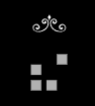

 

  

<h3 align="center">Conway's Game of Languages</h3>
  

    Conway's Game of Life - in multiple languages
  

## About The Project

This repository is meant as a practice for myself to write Conway's Game of Life in different languages. Additionally, I'm using this as an opportunity to learn Vim.

Each language has its own folder, containing instructions and my review of the language. NOTE! Since Conway's Game of Life is a rather small project, I will not be able to delve deep into the languages. Thus, the reviews will be rather surface-level.

### Languages already built with and their overall score

9:

8:

### Languages to be built with

         
